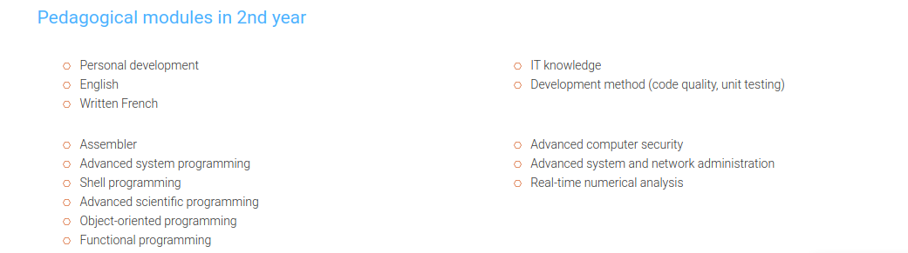

# **Description**

Epitech is a really different school from the ones we are used to seeing. l takes place over 5 years and trains professional and ready-to-use IT experts. It offers dense and varied technical content, including a diversity of programming projects, and covering many languages that will allow the student to approach all new technologies with serenity.

“At the end of the five-year course, the Epitech student is an expert in computer science, autonomous, responsible and perfectly adaptable to the business world. As he or she is technically speaking ultra-competent, the student obviously knows how to create and combine ideas and technology, but also how to surround themselves with the best partners to direct their projects. In a world that is in permanent evolution and where innovation dictates the rules, the student also has the necessary ammunition that is essential in order to succeed.”

> Emmanuel Carli, General Director

---

# **A two-cycle program**

### The 1st Cycle: three years for the Epitech Bachelor Degree

> { **Fundamentals || Consolidation || Mastery** }

The most noticeable aspect of the first two years is without doubt the omnipresent technique, seen across numerous large-scale projects of varied complexities. In order to reach this aspired level, Epitech students are confronted with a heavy workload and demanding rigour. Over and above the purely technical aspect, this learning method provides a real individual structure for the students. It forges their personal organisation, tests their perseverance and creates a real group work culture and collective success.

By relying on the solid base put in place in the 1st and 2nd years, the 3rd year at Epitech provides a quick and easy access to many computer domains (artificial intelligence, databases, security, advanced object orientation programming, network, and so on).

In order to reach operational level in a company leading to the Epitech Bachelor in Information Technology, the 3rd year makes it possible to bring together the big players in the market (Microsoft, Oracle, Cisco). The bases of the economic and relations mechanisms in a business are approached so as to allow the students to gain a good understanding of the economic context (commerce, communication, marketing, finance, law, etc).

---

### The 2nd cycle, or Expertise cycle, lasts 2 years :

> { **Internationalization || Leadership** }

The international dimension is essential at Epitech. The 4th year takes place entirely abroad, in one of our 90 partner universities. On the programme: discovering new cultures, observing one’s own country from abroad, learning new teaching methods and expanding one’s network. In a globalized world, a high-level career, especially in computer science, cannot be achieved in the absence of an international dimension. During this period, Epitech students are immersed in the heart of a new working environment and can choose the courses best suited to their career project and their centres of interest. They continue to work as a team on their Epitech Innovative Project, remotely and far from each other, as they would be led to do if they joined an international company.

During this last year, the students are inspired by more than 50 seminars given by high-level speakers: academics or professionals, French or foreign… They address topics as varied as the analysis of data, quantum computing, innovation management or artificial intelligence… At the same time, students work 3 days a week in a company and do a 6-month internship at the end of the course – two real bridges to the professional world. Those whose EIP project is already completed can also choose to devote this time to starting a business. This 5th year also sees the completion of 3 years of teamwork on the main project of the Epitech curriculum: The Epitech Innovative Project.

---

# **Opportunities**

- DEVOPS : Merger of developer and system administrator

- DEVELOPER: He/She is responsible for programming using computer languages, such as C++ or JAVA

- PROJECT MANAGER: He/She translates customer requests into IT Solutions

- CTO: He/She is in charge of the technological innovation of the company

- QUALITY ASSURANCE ENGINEER: He/She ensures the quality of software development and provides recommendations

- IT ARCHITECT: He/She designs and develops information systems, hardware, software, networks.