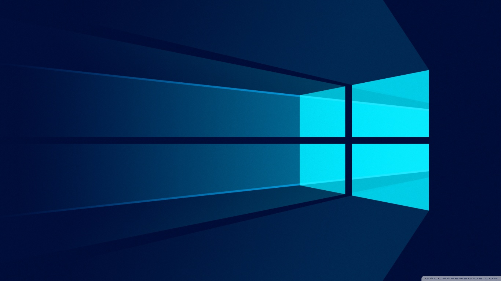
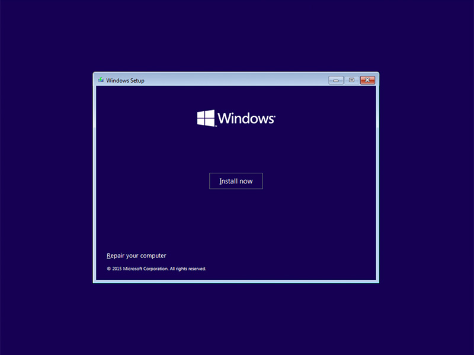
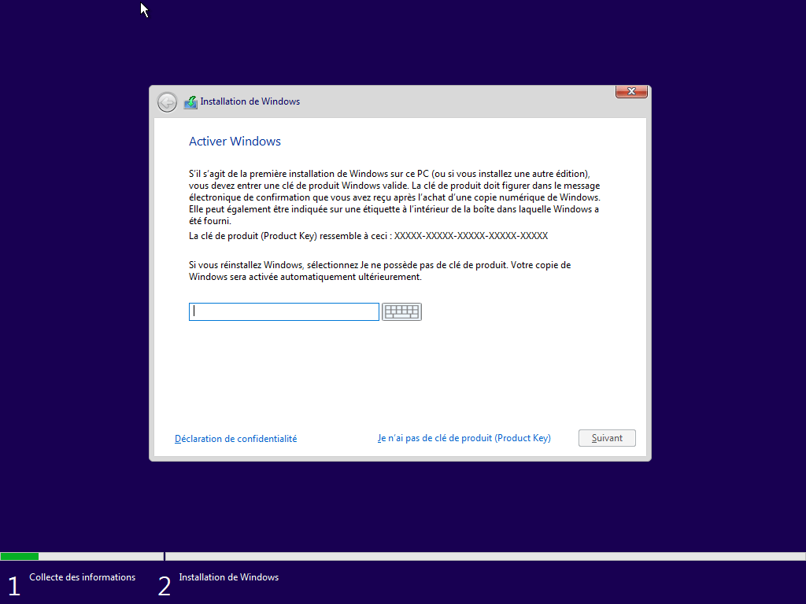
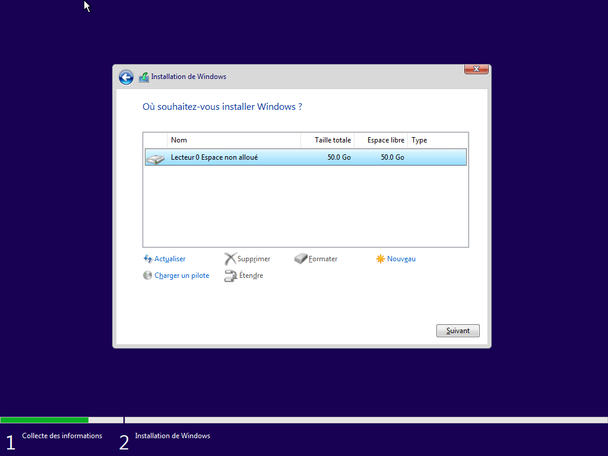

# Installations and configurations

## Installations

At Epitech you will be provided at the beginning of the year with a PC with **1 TB** (Terabyte) of memory and **8 GB** of RAM storage. As operating system Epitech will offer you **fedora** and **windows** to install.
Here we are going to see together step by step how to install in **dual boot** the Windows and linux systems (debian or fedora). Without further ado we will start by installing windows 10.

### Windows

Windows is a range of full-fledged operating systems produced by Microsoft for PCs.
We will start with the installation of Windows. You are going to wonder why Windows first? Well It is because of the **Grub** which is a computer boot program, its role is to organize the loading of the operating systems installed on the computer; it allows you to choose when booting the system on which you want to boot. The Windows Grub cannot allow us to see all the systems which are installed on the pc whereas a linux system does. By default the computer starts on the system grub installed in the last position, which then justifies the choice of the installation order which is: Windows first then comes the linux distribution that we want to install. An example of Grub:

**Fedora's grub**

First of all before starting the installation of windows you must first do what is called booting a key on windows (ie booting the usb key with the iso of windows 10). Epitech will provide you with a key already booting on Windows but in the event that you do not have a key already booting on Windows it is then up to you to boot a key (at least 8 GB).

#### Step 1
Insert the key in the pc and start the pc set the language and you will see a window like the one below, click on **install now**

#### Step 2

This is to enter an activation key that allows you to activate your Windows. The activation key is from Epitech is:

#### Step 3

We are now at the most important part, partitioning the hard drive. I remind you that I said at the beginning that we want to install two dual-boot systems on the pc. We will then divide the disk into two large partitions. To do this :

    1. Click on **new**;
    2. Enter the value of the new partition in bytes and validate;
    3. choose the partition and click **next** and the partitions will be created automatically.
